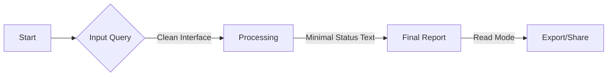

# Design Concept 1: Zen Mode (The Focused Researcher)

## 1. Core Philosophy
**"Distraction-free Insight."**
이 디자인은 사용자가 복잡한 설정이나 에이전트의 내부 로직보다는 **'질문'**과 **'최종 결과(리포트)'** 그 자체에 집중할 수 있도록 돕습니다. 불필요한 UI 요소를 최소화하고, 타이포그래피와 여백을 강조하여 마치 잘 편집된 매거진이나 고급 문서를 읽는 경험을 제공합니다.

## 2. Target User Experience
- **사용자:** 복잡한 툴 조작보다 빠른 결과 확인을 원하는 임원, 기획자, 혹은 작가.
- **감성:** 차분함, 명확함, 신뢰감.
- **핵심 가치:** "최소한의 입력으로 최대한의 통찰을."

## 3. UI Structure & Components

### 3.1 Search Console (Home)
- **Layout:** 화면 중앙에 거대한 검색바 하나만 배치 (구글 검색창보다 더 심플하고 모던하게).
- **Interactions:**
    - 검색바를 클릭하면 하단에 희미하게 `Quick Scan` / `Deep Probe` 토글과 `Auto-Pilot` 스위치가 나타남 (평소엔 숨김).
    - 배경은 아주 옅은 그라디언트나 추상적인 미니멀 아트웍을 사용하여 평온한 느낌.
- **Micro-copy:** "무엇을 깊이 탐구하시겠습니까?"

### 3.2 Status Dashboard (Processing)
- **Visuals:** 복잡한 로그나 그래프 대신, 화면 중앙에 **단 하나의 맥동하는(Pulsing) 오브젝트** (예: 추상적인 구체나 빛의 파동) 배치.
- **Feedback:** 현재 진행 상황을 한 문장의 자연어로 부드럽게 전환하며 표시.
    - *"주제를 분석하고 있습니다..."* -> *"신뢰할 수 있는 소스 5개를 찾았습니다..."* -> *"정보를 구조화하는 중입니다..."*
- **Detail:** 사용자가 원할 경우에만 '상세 보기' 버튼을 눌러 터미널 로그를 열 수 있음.

### 3.3 Report Viewer (Result)
- **Layout:** **Single Column Layout** (Notion이나 Medium 스타일).
- **Typography:** Serif (제목) + Sans-Serif (본문) 조합으로 가독성 극대화. 줄 간격을 넉넉하게.
- **Navigation:** 좌측이나 우측에 화면 스크롤에 따라 투명해지는 미니멀한 목차(ToC) 바(Bar).
- **Features:**
    - 인용구(Citations)는 본문 옆 마진(Margin)에 주석처럼 표시하거나, 클릭 시 팝오버로 깔끔하게 뜸.
    - 차트와 표는 본문 흐름을 끊지 않도록 넓은 너비로 배치.

## 4. Mermaid Diagram: User Flow

## 5. Pros & Cons (vs PRD)
| 장점 | 단점 |
| :--- | :--- |
| **극강의 가독성**: 결과물 읽기에 최적화됨. | **제어권 부족**: 에이전트가 무슨 일을 하는지 구체적으로 보기 어려움. |
| **낮은 진입장벽**: 누구나 바로 사용 가능. | **고급 기능 접근성 낮음**: 옵션이 숨겨져 있어 파워 유저에겐 답답할 수 있음. |
| **심미성**: 가장 세련되고 현대적인 느낌. | 복잡한 Plan Confirmation 단계가 UI 흐름을 깰 수 있음. |
