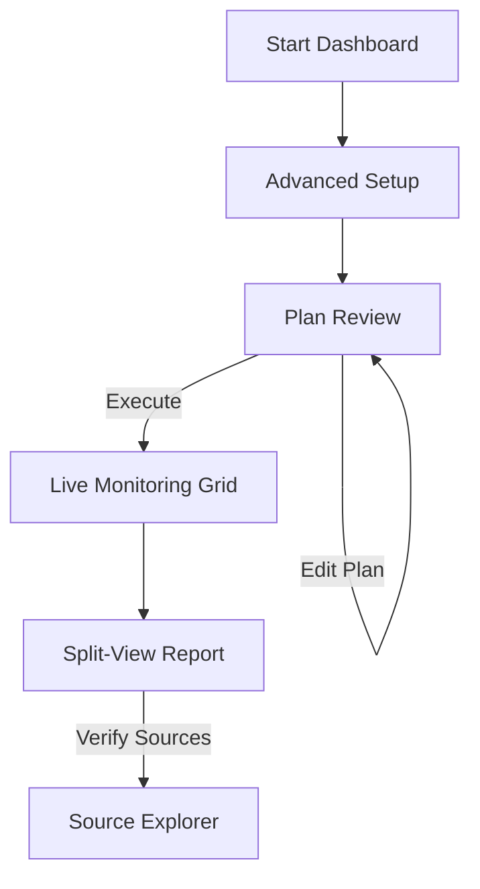

# Design Concept 2: Mission Control (The Intelligence Dashboard)

## 1. Core Philosophy
**"Total Visibility & Control."**
이 디자인은 에이전트의 모든 활동을 투명하게 공개하고, 사용자가 리서치 과정에 깊이 개입할 수 있도록 합니다. 전문가용 툴(Bloomberg Terminal, IDE, 데이터 분석 대시보드)과 같은 밀도 높은 정보량을 제공합니다.

## 2. Target User Experience
- **사용자:** 리서치 과정의 논리를 검증하고 싶은 연구원, 데이터 분석가, 개발자.
- **감성:** 전문적, 기계적, 정밀함.
- **핵심 가치:** "AI의 판단 과정을 감시하고 조율한다."

## 3. UI Structure & Components

### 3.1 Search Console (Home)
- **Layout:** 3단 분할 패널.
    - 좌측: 최근 검색 기록 및 저장된 프로젝트.
    - 중앙: 대형 검색 입력창 및 상세 설정 패널 (검색 기간, 선호 도메인, 제외 키워드 등 파라미터 직접 입력).
    - 우측: 현재 시스템 상태 (API 사용량, 모델 상태 등).
- **Interactions:** 모드 설정(Quick/Deep)이 탭이나 라디오 버튼으로 항상 노출되어 있음.

### 3.2 Status Dashboard (Processing)
- **Visuals:** **Grid Layout Dashboard.**
    - **Panel A (Plan):** 트리 구조로 시각화된 리서치 계획표. 현재 실행 중인 노드 하이라이트.
    - **Panel B (Search):** 실시간으로 수집되는 URL 리스트와 스크래핑 상태(성공/실패) 스트림.
    - **Panel C (Log):** 실시간 시스템 로그 터미널 창.
- **Feedback:** 각 단계별 소요 시간과 토큰 사용량 등을 수치로 표시.

### 3.3 Report Viewer (Result)
- **Layout:** **Split View (Split Pane).**
    - 좌측 패널: 최종 리포트 문서.
    - 우측 패널: 'Source Explorer'. 리포트의 특정 문장을 클릭하면, 우측 패널에 해당 문장의 근거가 된 원본 웹페이지 발췌문과 링크가 즉시 뜸.
- **Features:**
    - 리포트 내의 데이터가 클릭 가능하며, 클릭 시 Mermaid 차트가 모달이 아닌 인라인 아코디언으로 확장됨.
    - "Fact-Check" 버튼: AI가 작성한 문장마다 신뢰도 점수 표시.

## 4. Mermaid Diagram: User Flow

## 5. Pros & Cons (vs PRD)
| 장점 | 단점 |
| :--- | :--- |
| **높은 신뢰성**: 정보의 출처와 분석 과정을 낱낱이 확인 가능. | **정보 과부하**: 일반 사용자에게는 너무 복잡하고 압도적일 수 있음. |
| **정밀한 제어**: Plan Confirmation 기능과 가장 잘 어울림. | **모바일 부적합**: 화면 공간이 많이 필요하여 PC/태블릿 위주. |
| **파워 유저 선호**: 전문가들이 원하는 '도구'로서의 기능 충실. | 디자인이 딱딱하고 기능 위주로 흐를 위험. |
