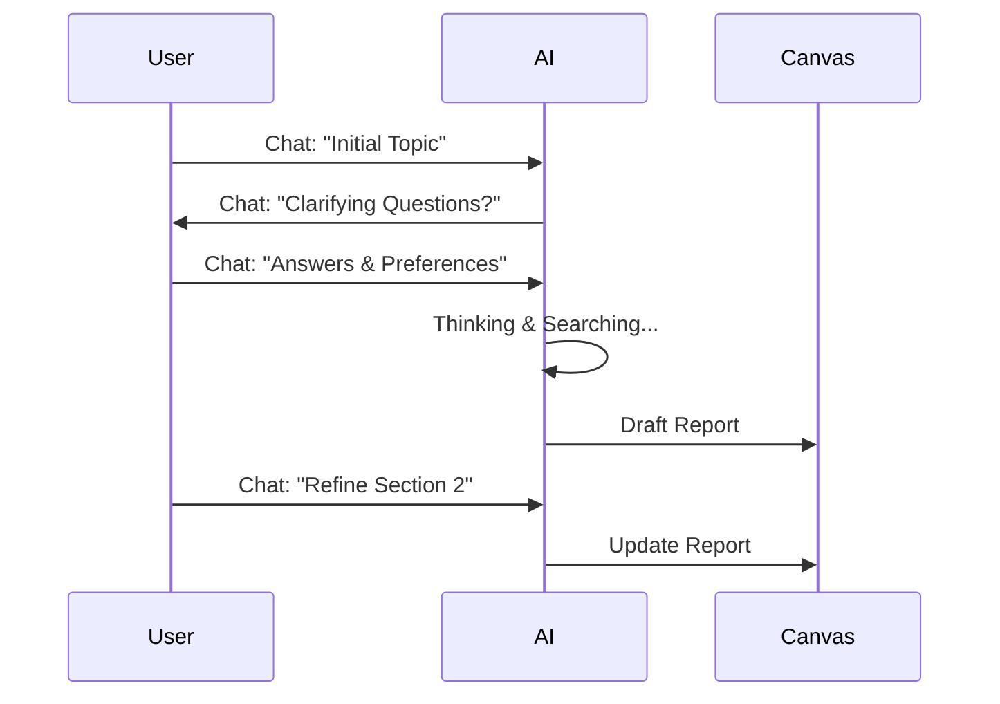

# Design Concept 3: Co-Pilot (The Collaborative Assistant)

## 1. Core Philosophy
**"Research Together."**
이 디자인은 챗봇(Chat Interface)과 문서 에디터(Doc Editor)를 결합한 형태입니다. 사용자는 AI와 대화하며 리서치 방향을 잡고, AI가 찾아온 정보를 바탕으로 함께 문서를 완성해 나가는 협업 경험을 제공합니다.

## 2. Target User Experience
- **사용자:** 아이디어 디벨롭이 필요한 기획자, 학생, 브레인스토밍이 필요한 팀.
- **감성:** 친근함, 대화형, 상호작용적.
- **핵심 가치:** "단순한 검색기가 아닌, 똑똑한 연구 조교와 대화하듯이."

## 3. UI Structure & Components

### 3.1 Search Console (Home)
- **Layout:** 친숙한 채팅 인터페이스 (ChatGPT/Claude 스타일).
- **Interactions:**
    - "무엇을 도와드릴까요?" 프롬프트와 함께 시작.
    - 사용자가 모호하게 질문하면, AI가 역질문(Clarifying Questions)을 통해 의도를 파악하고 검색 범위를 좁힘.
    - 예: "전기차 시장 조사해줘" -> AI: "어떤 지역(미국/유럽/중국)을 중점으로 볼까요? 아니면 기술 트렌드 위주인가요?"

### 3.2 Status Dashboard (Processing)
- **Visuals:** **Chat Stream + Thought Bubble.**
    - 채팅창 내에 AI의 '생각(Thought)' 블록이 열리며 진행 상황 표시.
    - Plan Confirmation 모드가 자연스럽게 채팅 흐름에 녹아듦.
    - AI: "이런 목차로 조사해보려고 합니다. 괜찮으신가요?" -> [승인] [수정 요청] 버튼.
- **Feedback:** 딱딱한 로그 대신 대화체로 진행 상황 보고.

### 3.3 Report Viewer (Result)
- **Layout:** **Canvas Interface (Like Canvas in OpenAI or Artifacts in Claude).**
    - 좌측: 채팅창 (계속해서 추가 질문 가능).
    - 우측: 완성된 리포트 프리뷰 (Canvas).
- **Features:**
    - 사용자가 채팅으로 "3번 섹션 좀 더 자세히 써줘"라고 하면 우측 리포트 내용이 실시간으로 업데이트됨.
    - 리포트의 특정 부분을 드래그하여 부분 수정 요청 가능.

## 4. Mermaid Diagram: User Flow

## 5. Pros & Cons (vs PRD)
| 장점 | 단점 |
| :--- | :--- |
| **높은 유연성**: 결과물이 마음에 안 들면 바로 수정 요청 가능. | **전체 구조 파악 어려움**: 채팅이 길어지면 맥락을 놓칠 수 있음. |
| **친숙함**: LLM 채팅 UI에 익숙한 사용자들에게 자연스러움. | **긴 호흡의 리서치 불리**: 한 번의 클릭으로 완벽한 리포트를 원하는 니즈와는 상충. |
| **반복 개선(Iteration)**: 초안을 바탕으로 완성도를 높이기에 최적. | 복잡한 시각화나 데이터 구조를 채팅으로 제어하기 까다로울 수 있음. |
